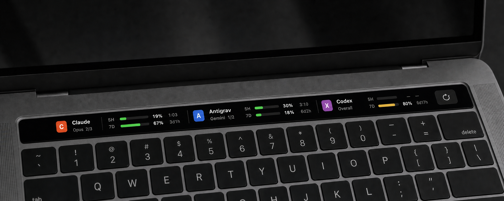

# Touch Bar Usage Monitor

A small native macOS utility that puts Claude Code, Antigravity, Codex, and GitHub Copilot quota usage on the physical Touch Bar whenever Warp is frontmost.



Each compact card shows the provider and selected model group beside progress bars, percentage **used**, and time remaining until reset. Claude, Antigravity, and Codex show 5H/7D windows when available; Copilot shows its monthly AI Credits or legacy premium-request allowance.

> [!IMPORTANT]
> This project uses an undocumented AppKit system-modal Touch Bar API. It is intended for personal, local installation and cannot be distributed through the Mac App Store. A future macOS update could break this behavior.

## Requirements

- A MacBook Pro with a physical Touch Bar.
- macOS 12 or later.
- Apple Command Line Tools (`xcode-select --install`).
- [Warp](https://www.warp.dev/) Stable, Preview, or the standard Warp build.
- At least one supported provider CLI, authenticated for the current macOS user:
  - Claude Code (`claude`)
  - Antigravity (`agy`)
  - Codex (`codex`)
  - GitHub Copilot CLI (`copilot`)

Missing or unauthenticated providers report an error in the menu-bar status and do not prevent the others from working.

## Install

```sh
git clone https://github.com/bankthananan/touchbar-usage-monitor.git
cd touchbar-usage-monitor
make test
make install
```

`make install` builds an ad-hoc-signed app, copies it to `~/Applications`, and installs a per-user LaunchAgent so it starts at login. No administrator access is required.

### Provider setup

1. Sign in to each provider CLI you want to monitor. For Copilot, run `copilot login` if its interactive footer does not show your allowance.
2. For Antigravity, trust the cloned project directory once:

   ```sh
   cd /path/to/touchbar-usage-monitor
   agy
   ```

   Choose **Yes, I trust this folder**, then exit. The installer configures the monitor to use this directory and never accepts the trust prompt for you.

3. On the first Claude refresh, macOS may ask whether Touch Bar Usage Monitor can read the `Claude Code-credentials` Keychain item. Choose **Always Allow** for automatic updates.

## Use

- Focus Warp to show the selected quota cards on the Touch Bar. All four providers are enabled by default.
- Switch away from Warp to restore the next app's Touch Bar.
- Open the `TB` menu-bar item and check or uncheck **Visible Touch Bar bands** to choose which providers appear. The selection is saved and applied immediately.
- Tap a card to cycle through that provider's available quota groups. The card title shows the group and position, such as `Gemini 1/2`.
- Drag a card horizontally to reorder the providers. The order is saved across launches.
- Tap the refresh icon to update every provider immediately. Tapping a single-group card, such as Codex, also refreshes.
- Open the `TB` menu-bar item to see provider errors or choose **Refresh now**.

Refresh intervals are one minute for Claude and Codex, and five minutes for Antigravity and Copilot. Reset countdowns update whenever fresh provider data arrives.

### Selectable quota groups

| Provider | Groups shown when available |
| --- | --- |
| Claude | Overall, Sonnet, Opus, OAuth Apps, and future model-specific `seven_day_*` quotas. Claude's shared 5H session stays visible beside the selected model's weekly quota. |
| Antigravity | Gemini and Other (the Claude/GPT model group), each with its own 5H and weekly quota. |
| Codex | The quota windows returned by `codex app-server`; currently a single card state. |
| Copilot | Monthly AI Credits on current billing or monthly premium requests on legacy billing. The allowance resets at 00:00 UTC on the first day of each calendar month. |

## What the app reads

| Provider | Local integration | Network behavior |
| --- | --- | --- |
| Claude | Reads the existing Claude Code OAuth record from Keychain with Security.framework. | Calls Anthropic's usage endpoint with the in-memory token. |
| Codex | Starts `codex app-server --stdio` and requests `account/rateLimits/read`. | The Codex CLI handles its normal account connection. |
| Antigravity | Opens `agy` in a local pseudo-terminal, runs `/usage`, parses the Gemini and Claude/GPT groups, then exits. | The Antigravity CLI handles its normal account connection. |
| Copilot | Opens `copilot` in a local pseudo-terminal, runs `/usage`, parses the monthly allowance, then exits. | The Copilot CLI handles its normal account connection. |

Tokens are never logged or written into this repository. Antigravity reports percentage remaining; the app converts it to percentage used so every card is consistent. Copilot's monthly reset follows [GitHub's documented billing schedule](https://docs.github.com/en/copilot/reference/copilot-billing/license-changes#included-monthly-allowance-reset).

Provider response formats are not controlled by this project. If a provider returns only one quota window, the other field remains `—`.

## Build and test

```sh
make test       # parser unit tests
make build      # app bundle at build/TouchBarUsageMonitor.app
make all        # test, then build
make smoke      # live provider checks; requires signed-in CLIs
make clean
```

The project uses Objective-C, AppKit, Foundation, and Security.framework. It has no third-party build dependencies.

## Uninstall

```sh
make uninstall
```

This removes the app from `~/Applications` and unloads/removes its per-user LaunchAgent. It does not change provider credentials or CLI configuration.

## Contributing and security

Bug reports and pull requests are welcome. Read [CONTRIBUTING.md](CONTRIBUTING.md) before submitting a change. For credential-handling concerns, follow [SECURITY.md](SECURITY.md).

## License

[MIT](LICENSE)
